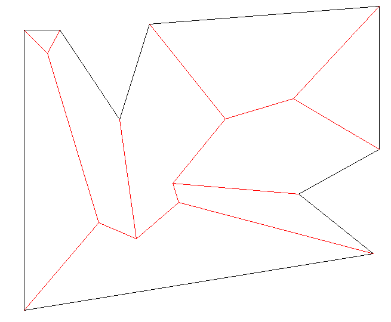

# Polyskel

This is a Python 3 implementation of the straight skeleton algorithm as described by Felkel and Obdržálek in their 1998 conference paper [Straight skeleton implementation](doc/StraightSkeletonImplementation.pdf).

The algorithm itself is fairly dated, and shown to be incorrect for certain input polygons.
This implementation is a bit crap, and does not really attempt to fix the algorithm.
It works kinda okay for most real-life input (for example country contours or floor plans).

For a modern and excellent overview of the topic please refer to Stefan Huber's excellent [Computing Straight Skeleton and Motorcycle Graphs: Theory and Practice](https://www.sthu.org/research/publications/files/phdthesis.pdf).

## Installation and prerequisites

You will need Python 3.8.1.
Download the repo and install using pip: `pip install -r requirements.txt`.
We use `euclid3` for geometry computations, and the demo uses `Pillow` to display the images.

## Demo

Use `demo.py` for a demonstration.
The demo parses an input polygon file, and outputs a tree structure representing the straight skeleton, as well as an image of the polygon with the skeleton.

`demo.py [-h] [--verbose] [--log {DEBUG,INFO,WARNING,ERROR}] <polygon-file>`

- `-h` show the help message and exit.
- `--verbose` output an image after every event, marking the current state of the skeleton and the bisectors of all vertices. Do not do this for large polygons
- `--log` set the lowest log level to display. Polyskel logs events at info level, and further information at debug level.
- `<polygon-file>` the text file describing the polygon. The polygon is to be given as a counter-clockwise series of vertices specified by their coordinates. Holes can be specified as a clockwise series of coordinates. A number of example inputs are supplied in the `examples` folder.

---

Check out [Yongha Hwang's fork](https://github.com/yonghah/polyskel) to see polyskel in [sweet real-life action](https://github.com/yonghah/polyskel/blob/master/Create%20layout%20network%20using%20straight%20skeletons%20.ipynb) <3 <3 <3.

There is also [a Swift port](https://github.com/andygeers/Polyskel-Swift) available of Yongha Hwang's version.

[bpolyskel](https://github.com/prochitecture/bpypolyskel) is a port for Blender, making [some sweet roofs](https://user-images.githubusercontent.com/613295/94917497-4fd8c800-04b9-11eb-89ba-2f4f47f5b416.png) <3.
